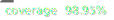

# Comet Multiplier Adapter

[](./coverage)
[](./test)
[](./LICENSE)
[](https://soliditylang.org/)
[](https://hardhat.org/)

A modular smart contract system for creating leveraged positions and swapping collateral on Compound v3 (Comet) markets using flash loans and DEX aggregators.

## Overview

The system provides two core functionalities:

### 1. Leveraged Position Management (CometMultiplier)

Create and manage leveraged collateral positions in a single transaction by:

1. Taking a flash loan from lending protocols (Morpho, Euler, UniswapV3)
2. Swapping borrowed base assets to collateral via DEX aggregators (LiFi, 1inch)
3. Depositing collateral into Compound v3 and borrowing against it
4. Repaying the flash loan

This creates a leveraged position without requiring multiple manual transactions.

### 2. Collateral Swapping (CometCollateralSwap)

Swap one collateral asset for another within existing Compound V3 positions using flash loans. The contract maintains the user's debt position while changing collateral composition, enabling portfolio rebalancing without closing positions.

## Architecture

The system uses a plugin-based architecture:

```
CometMultiplier & CometCollateralSwap
├── Loan Plugins (Flash Loan Sources)
│   ├── MorphoPlugin - Morpho Blue flash loans
│   ├── EulerV2Plugin - Euler V2 flash loans
│   ├── AAVEPlugin - AAVE flash loans
│   ├── BalancerPlugin - Balancer vault flash loans
│   └── UniswapV3Plugin - Uniswap V3 flash swaps
│
└── Swap Plugins (DEX Aggregators)
    ├── LiFiPlugin - LiFi cross-chain swaps
    ├── OneInchV6SwapPlugin - 1inch v6 aggregator
    └── WstEthPlugin - wstETH wrapping/unwrapping
```

## How It Works

### Leverage Creation Flow

The `CometMultiplier` contract creates leveraged positions using flash loans:

```
┌─────────────────────────────────────────────────────────────────────────────┐
│                  LEVERAGE CREATION FLOW (2x WETH Position)                  │
└─────────────────────────────────────────────────────────────────────────────┘

1. USER INITIATES LEVERAGE
   User ──► CometMultiplier.executeMultiplier(1 WETH, 2x leverage)
   ✅ User deposits: 1 WETH

2. FLASH LOAN REQUEST
   CometMultiplier ──► FlashLoanPlugin.takeFlashLoan(2500 USDC)
   FlashLoanPlugin ──► Morpho/Euler/Uniswap.flashLoan(2500 USDC)

3. FLASH LOAN CALLBACK
   Morpho/Euler/Uniswap ──► CometMultiplier.fallback()
   ✅ Contract Balance: 1 WETH + 2500 USDC

4. SWAP BORROWED ASSET
   CometMultiplier ──► SwapPlugin.executeSwap(2500 USDC → WETH)
   SwapPlugin ──► 1inch/LiFi.swap(2500 USDC → 0.996 WETH)
   ✅ Contract Balance: 1.996 WETH total

5. SUPPLY COLLATERAL TO USER
   CometMultiplier ──► Comet.supplyTo(user, 1.996 WETH)
   ✅ User's WETH collateral: 1.996 WETH

6. BORROW AGAINST COLLATERAL
   CometMultiplier ──► Comet.withdrawFrom(user, 2507.5 USDC)
   ✅ User's debt: 2507.5 USDC (includes flash loan fee)
   ✅ Contract Balance: 2507.5 USDC

7. REPAY FLASH LOAN
   CometMultiplier ──► FlashLoanPlugin.repayFlashLoan(2507.5 USDC)
   FlashLoanPlugin ──► Morpho/Euler/Uniswap.repay(2500 + 7.5 fee)
   ✅ Contract Balance: 0

RESULT: User has 2x leveraged WETH position (1.996 WETH collateral, 2507.5 USDC debt)
```

### Leverage Reduction Flow

The `CometMultiplier` contract can also reduce or close leveraged positions:

```
┌─────────────────────────────────────────────────────────────────────────────┐
│              LEVERAGE REDUCTION FLOW (2x → 1x WETH Position)                │
└─────────────────────────────────────────────────────────────────────────────┘

1. USER INITIATES DELEVERAGE
   User ──► CometMultiplier.withdrawMultiplier(1 WETH withdraw)
   Current position: 2 WETH collateral, 2500 USDC debt

2. FLASH LOAN REQUEST
   CometMultiplier ──► FlashLoanPlugin.takeFlashLoan(2507.5 USDC)
   FlashLoanPlugin ──► Morpho/Euler/Uniswap.flashLoan(2507.5 USDC)

3. FLASH LOAN CALLBACK
   Morpho/Euler/Uniswap ──► CometMultiplier.fallback()
   ✅ Contract Balance: 2507.5 USDC

4. REPAY USER'S DEBT
   CometMultiplier ──► Comet.supplyTo(user, 2507.5 USDC)
   ✅ User's debt: 0 USDC (paid off)

5. WITHDRAW COLLATERAL
   CometMultiplier ──► Comet.withdrawFrom(user, 1 WETH)
   ✅ Contract Balance: 1 WETH

6. SWAP COLLATERAL TO BASE
   CometMultiplier ──► SwapPlugin.executeSwap(1 WETH → USDC)
   SwapPlugin ──► 1inch/LiFi.swap(1 WETH → 2490 USDC)
   ✅ Contract Balance: 2490 USDC

7. REPAY FLASH LOAN
   CometMultiplier ──► FlashLoanPlugin.repayFlashLoan(2515 USDC)
   FlashLoanPlugin ──► Morpho/Euler/Uniswap.repay(2507.5 + 7.5 fee)
   ✅ Contract Balance: -25 USDC (covered by remaining collateral value)

8. RETURN REMAINDER TO USER
   CometMultiplier ──► Transfer remaining tokens to user
   ✅ User receives any excess USDC from position closure

RESULT: User deleveraged from 2x to 1x. Remaining 0.996 WETH collateral + no debt
```

### Collateral Swap Flow

The `CometCollateralSwap` contract enables users to swap collateral in their Compound v3 position without closing their borrowing position:

```
┌─────────────────────────────────────────────────────────────────────────────┐
│                    COLLATERAL SWAP FLOW (WETH → USDC)                      │
└─────────────────────────────────────────────────────────────────────────────┘

1. USER INITIATES SWAP
   User ──► CometCollateralSwap.swap(fromAsset: WETH, toAsset: USDC)

2. HEALTH FACTOR VALIDATION
   CometCollateralSwap ──► Validates position safety after swap

3. FLASH LOAN REQUEST
   CometCollateralSwap ──► FlashLoanPlugin.takeFlashLoan(1000 USDC)
   FlashLoanPlugin ──► AAVE/Balancer/Uniswap.flashLoan(1000 USDC)

4. FLASH LOAN CALLBACK
   AAVE/Balancer/Uniswap ──► CometCollateralSwap.fallback()
   ✅ Contract Balance: +1000 USDC

5. SUPPLY BORROWED ASSET
   CometCollateralSwap ──► Comet.supplyTo(user, 1000 USDC)
   ✅ User's USDC collateral increases, health factor improves

6. WITHDRAW EXISTING COLLATERAL
   CometCollateralSwap ──► Comet.withdrawFrom(user, 0.5 WETH)
   ✅ Contract Balance: 1000 USDC + 0.5 WETH

7. SWAP WITHDRAWN COLLATERAL
   CometCollateralSwap ──► SwapPlugin.executeSwap(0.5 WETH → USDC)
   SwapPlugin ──► 1inch/LiFi.swap(0.5 WETH → 1005 USDC)
   ✅ Contract Balance: 2005 USDC total

8. SUPPLY DUST BACK TO USER
   CometCollateralSwap ──► Comet.supplyTo(user, dust USDC)
   ✅ Excess USDC supplied back to user's position

9. REPAY FLASH LOAN
   CometCollateralSwap ──► FlashLoanPlugin.repayFlashLoan(1005 USDC)
   FlashLoanPlugin ──► AAVE/Balancer/Uniswap.repay(1000 + 5 fee)
   ✅ Contract Balance: 0

RESULT: User's collateral successfully swapped from WETH to USDC in Comet
```

### Leverage Token Flow Breakdown

| Stage                 | Contract Balance      | User Position                        | Action                           | External Call                    |
| --------------------- | --------------------- | ------------------------------------ | -------------------------------- | -------------------------------- |
| **Initial**           | 1 WETH                | 0 collateral<br/>0 debt              | User calls `executeMultiplier()` | User transfers 1 WETH            |
| **Flash Loan**        | 1 WETH<br/>+2500 USDC | 0 collateral<br/>0 debt              | Flash loan received              | `FlashProvider.flashLoan()`      |
| **Swap**              | ~2 WETH               | 0 collateral<br/>0 debt              | Swap borrowed USDC to WETH       | `DEX.swap(USDC → WETH)`          |
| **Supply Collateral** | 0                     | 2 WETH collateral<br/>0 debt         | Supply total collateral          | `Comet.supplyTo(user, 2 WETH)`   |
| **Borrow**            | +2500 USDC            | 2 WETH collateral<br/>2500 USDC debt | Borrow against collateral        | `Comet.withdrawFrom(user, USDC)` |
| **Repay**             | 0                     | 2 WETH collateral<br/>2500 USDC debt | Repay flash loan + fee           | `FlashProvider.repay(2505 USDC)` |

**Result**: User invested 1 WETH, now has 2 WETH collateral (2x leverage). Profit amplifies 2x on WETH price increases.

### Leverage Reduction Token Flow Breakdown

| Stage           | Contract Balance | User Position                        | Action                            | External Call                    |
| --------------- | ---------------- | ------------------------------------ | --------------------------------- | -------------------------------- |
| **Initial**     | 0                | 2 WETH collateral<br/>2500 USDC debt | User calls `withdrawMultiplier()` | -                                |
| **Flash Loan**  | +2500 USDC       | 2 WETH collateral<br/>2500 USDC debt | Flash loan received               | `FlashProvider.flashLoan()`      |
| **Repay Debt**  | 0                | 2 WETH collateral<br/>0 debt         | Repay user's debt                 | `Comet.supplyTo(user, USDC)`     |
| **Withdraw**    | +1 WETH          | 1 WETH collateral<br/>0 debt         | Withdraw collateral               | `Comet.withdrawFrom(user, WETH)` |
| **Swap**        | ~2500 USDC       | 1 WETH collateral<br/>0 debt         | Swap WETH to USDC                 | `DEX.swap(WETH → USDC)`          |
| **Repay Flash** | ~0               | 1 WETH collateral<br/>0 debt         | Repay flash loan + fee            | `FlashProvider.repay(2505 USDC)` |
| **Return Dust** | 0                | 1 WETH collateral<br/>0 debt         | Return remainder to user          | Transfer remaining to user       |

**Result**: User deleveraged from 2x to 1x. Started with 2 WETH collateral + debt, ended with 1 WETH collateral + no debt.

### Collateral Swap Token Flow Breakdown

| Stage           | Contract Balance         | Action                        | External Call                    |
| --------------- | ------------------------ | ----------------------------- | -------------------------------- |
| **Initial**     | 0                        | User calls `swap()`           | -                                |
| **Flash Loan**  | +1000 USDC               | Flash loan received           | `FlashProvider.flashLoan()`      |
| **Supply**      | 1000 USDC                | Supply borrowed asset to user | `Comet.supplyTo(user, USDC)`     |
| **Withdraw**    | 1000 USDC<br/>+0.5 WETH  | Withdraw user's collateral    | `Comet.withdrawFrom(user, WETH)` |
| **Swap**        | ~2005 USDC<br/>-0.5 WETH | Swap withdrawn collateral     | `DEX.swap(WETH → USDC)`          |
| **Supply Dust** | ~1005 USDC               | Supply excess back to user    | `Comet.supplyTo(user, dust)`     |
| **Repay**       | 0                        | Repay flash loan + fee        | `FlashProvider.repay(1005 USDC)` |

## Key Features

- **Leveraged Position Creation**: Open leveraged positions in a single atomic transaction
- **Atomic Collateral Swaps**: Swap collateral assets in a single transaction
- **Health Factor Protection**: Validates position remains safe before execution
- **Multi-Protocol Support**: Works with AAVE, Balancer, Uniswap V3, Morpho, Euler
- **Optimal Routing**: Uses 1inch and LiFi for best swap execution
- **Signature-Based Authorization**: Support for gasless approvals via EIP-712
- **Plugin Architecture**: Modular design for extensibility and upgradability
- **Native ETH Support**: Direct ETH deposits with automatic WETH wrapping
- **Gas Efficiency**: Delegate calls and transient storage minimize gas costs
- **Dust Management**: Automatically supplies leftover tokens back to user's position

## Modules

### Core Contracts

**CometMultiplier** - Main contract that orchestrates flash loans, swaps, and Comet interactions for leveraged positions

- `executeMultiplier()` - Create leveraged position
- `executeMultiplierBySig()` - Create leveraged position with signature
- `withdrawMultiplier()` - Reduce or close leveraged position
- `withdrawMultiplierBySig()` - Reduce leveraged position with signature

**CometCollateralSwap** - Contract for swapping collateral within existing positions

- `swap()` - Execute collateral swap
- `swapWithApprove()` - Execute swap with signature-based authorization

### Loan Plugins

**MorphoPlugin** - Flash loans from Morpho Blue

- Zero-fee flash loans
- High liquidity for major assets
- ERC-3156 compliant

**EulerV2Plugin** - Flash loans from Euler V2 vaults

- Vault-specific liquidity
- Competitive fees
- Per-vault flash loan support

**AAVEPlugin** - Flash loans from AAVE V3

- Wide asset support
- High liquidity
- Competitive fees

**BalancerPlugin** - Flash loans from Balancer Vault

- No fees on flash loans
- High liquidity for major tokens
- Single transaction execution

**UniswapV3Plugin** - Flash swaps from Uniswap V3 pools

- Decentralized liquidity source
- No permission required
- Pool-specific availability

### Swap Plugins

**LiFiPlugin** - DEX aggregation via LiFi Diamond

- Cross-chain swap support
- Multi-DEX routing
- Optimal execution prices

**OneInchV6SwapPlugin** - 1inch v6 aggregator

- Best price discovery
- Gas optimization
- Limit order support

**WstEthPlugin** - wstETH wrapping/unwrapping

- Direct Lido integration
- Efficient stETH <-> wstETH conversion
- No slippage for wrapping

## Supported Networks

- **Mainnet** - Full plugin support (Morpho, Euler, UniV3, AAVE, Balancer, LiFi, 1inch, wstETH)

## Installation

Prerequisites: [Node.js](https://nodejs.org/en/download/package-manager) 22.10+ with `pnpm` and [Visual Studio Code](https://code.visualstudio.com/download).

```shell
pnpm i
```

## Configuration

Edit `scripts/deploy/deploy.config.ts` to configure deployment for each network:

```typescript
export const deployConfig: Record<string, DeployConfig> = {
  mainnet: {
    weth: "0xC02aaA39b223FE8D0A0e5C4F27eAD9083C756Cc2",
    plugins: {
      loanPlugins: {
        morpho: "0xBBBBBbbBBb9cC5e90e3b3Af64bdAF62C37EEFFCb",
        euler: "0x797DD80692c3b2dAdabCe8e30C07fDE5307D48a9",
        aave: "0x87870Bca3F3fD6335C3F4ce8392D69350B4fA4E2",
        balancer: "0xBA12222222228d8Ba445958a75a0704d566BF2C8",
        uniswapV3: "0x88e6A0c2dDD26FEEb64F039a2c41296FcB3f5640",
      },
      swapPlugins: {
        lifi: "0x1231DEB6f5749EF6cE6943a275A1D3E7486F4EaE",
        oneInch: "0x111111125421cA6dc452d289314280a0f8842A65",
        wsteth: "0x7f39C581F595B53c5cb19bD0b3f8dA6c935E2Ca0",
      },
    },
  },
};
```

## Deployment

Deploy to any configured network:

```shell
npx hardhat run scripts/deploy/deploy.main.ts --network mainnet
```

Deployment addresses are saved to `deployments/{network}.json`

### Deployment Structure

After successful deployment, `deployments/{network}.json` contains addresses for all contracts:

```json
{
  "loanPlugins": {
    "morpho": { "endpoint": "0x...", "flp": "0x..." },
    "euler": { "endpoint": "0x...", "flp": "0x..." },
    "aave": { "endpoint": "0x...", "flp": "0x..." },
    "balancer": { "endpoint": "0x...", "flp": "0x..." },
    "uniswapV3": { "endpoint": "0x...", "flp": "0x..." }
  },
  "swapPlugins": {
    "lifi": { "endpoint": "0x...", "router": "0x..." },
    "oneInch": { "endpoint": "0x...", "router": "0x..." },
    "wsteth": { "endpoint": "0x...", "router": "0x..." }
  },
  "CometMultiplier": "0x...",
  "CometCollateralSwap": "0x..."
}
```

## Documentation

This project includes detailed documentation for its core components:

- **[CometMultiplier](./documentation/CometMultiplier.md)** - Comprehensive documentation for leveraged position management, including architecture, usage patterns, and integration examples.

- **[CometCollateralSwap](./documentation/CometCollateralSwap.md)** - Complete guide to the collateral swap contract, covering swap mechanics, health factor validation, and safety mechanisms.

- **[Flash Loan Plugins](./documentation/plugins/Flash.md)** - Complete guide to the modular flash loan plugin system, covering the unified interface, validation mechanisms, and available protocol integrations (AAVE, Balancer, Uniswap V3, Euler V2, Morpho, etc.).

- **[Swap Plugins](./documentation/plugins/Swap.md)** - Detailed documentation for the modular swap plugin system, including the unified interface, validation logic, and integrations with DEX protocols and aggregators (1inch V6, LiFi, cross-chain swaps).

## Testing

Run all tests:

```shell
pnpm test
```

Coverage:

```shell
pnpm coverage
```
