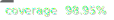

# CometFoundation

[](./coverage)
[](./test)
[](./LICENSE)
[](https://soliditylang.org/)
[](https://hardhat.org/)

A unified smart contract system for DeFi operations on Compound V3 (Comet) markets using flash loans and DEX aggregators. CometFoundation provides three core functionalities in a single, gas-efficient contract: leveraged position creation, position reduction, and collateral swapping.

## Overview

CometFoundation offers three atomic operations:

### 1. Multiply - Create Leveraged Positions

Open or increase leveraged collateral positions in a single transaction by:

1. Taking a flash loan from lending protocols (Morpho, Euler, UniswapV3, AAVE, Balancer)
2. Swapping borrowed base assets to collateral via DEX aggregators (LiFi, 1inch)
3. Depositing collateral into Compound V3 and borrowing against it
4. Repaying the flash loan

### 2. Cover - Reduce Leveraged Positions

Reduce or close leveraged positions atomically by:

1. Taking a flash loan to temporarily repay debt
2. Withdrawing unlocked collateral
3. Swapping collateral back to base asset
4. Repaying the flash loan from swap proceeds

### 3. Exchange - Swap Collateral Assets

Swap one collateral type for another within existing positions while maintaining debt:

1. Validating position health factor will remain safe
2. Taking a flash loan of target collateral
3. Supplying borrowed collateral to improve position
4. Withdrawing original collateral
5. Swapping to repay flash loan

## Architecture

The system uses a unified contract with a plugin-based architecture:

```
CometFoundation (Unified Contract)
├── Flash Loan Plugins
│   ├── MorphoPlugin - Morpho Blue (zero-fee)
│   ├── EulerV2Plugin - Euler V2 vaults
│   ├── AAVEPlugin - AAVE V3 pools
│   ├── BalancerPlugin - Balancer vault
│   └── UniswapV3Plugin - Uniswap V3 pools
│
└── Swap Plugins
    ├── LiFiPlugin - LiFi cross-chain aggregator
    ├── OneInchV6Plugin - 1inch v6 aggregator
    └── WstEthPlugin - Lido wstETH wrapper
```

## How It Works

### Multiply Flow (Create 2x Leverage)

```
┌─────────────────────────────────────────────────────────────────────────────┐
│                  LEVERAGE CREATION FLOW (2x WETH Position)                  │
└─────────────────────────────────────────────────────────────────────────────┘

1. USER INITIATES LEVERAGE
   User ──► CometFoundation.multiply(1 WETH, 20000 bps)
   ✅ User deposits: 1 WETH

2. FLASH LOAN REQUEST
   CometFoundation ──► FlashLoanPlugin.takeFlashLoan(2500 USDC)
   FlashLoanPlugin ──► Morpho/Euler/Uniswap.flashLoan(2500 USDC)

3. FLASH LOAN CALLBACK
   Morpho/Euler/Uniswap ──► CometFoundation.fallback()
   ✅ Contract Balance: 1 WETH + 2500 USDC

4. SWAP BORROWED ASSET
   CometFoundation ──► SwapPlugin.swap(2500 USDC → WETH)
   SwapPlugin ──► 1inch/LiFi.swap(2500 USDC → 0.996 WETH)
   ✅ Contract Balance: 1.996 WETH total

5. SUPPLY COLLATERAL TO USER
   CometFoundation ──► Comet.supplyTo(user, 1.996 WETH)
   ✅ User's WETH collateral: 1.996 WETH

6. BORROW AGAINST COLLATERAL
   CometFoundation ──► Comet.withdrawFrom(user, 2507.5 USDC)
   ✅ User's debt: 2507.5 USDC (includes flash loan fee)
   ✅ Contract Balance: 2507.5 USDC

7. REPAY FLASH LOAN
   CometFoundation ──► FlashLoanPlugin.repayFlashLoan(2507.5 USDC)
   FlashLoanPlugin ──► Morpho/Euler/Uniswap.repay(2500 + 7.5 fee)
   ✅ Contract Balance: 0

RESULT: User has 2x leveraged WETH position (1.996 WETH collateral, 2507.5 USDC debt)
```

### Cover Flow (Reduce Leverage)

```
┌─────────────────────────────────────────────────────────────────────────────┐
│              LEVERAGE REDUCTION FLOW (2x → 1x WETH Position)                │
└─────────────────────────────────────────────────────────────────────────────┘

1. USER INITIATES DELEVERAGE
   User ──► CometFoundation.cover(1 WETH withdraw)
   Current position: 2 WETH collateral, 2500 USDC debt

2. FLASH LOAN REQUEST
   CometFoundation ──► FlashLoanPlugin.takeFlashLoan(2507.5 USDC)
   FlashLoanPlugin ──► Morpho/Euler/Uniswap.flashLoan(2507.5 USDC)

3. FLASH LOAN CALLBACK
   Morpho/Euler/Uniswap ──► CometFoundation.fallback()
   ✅ Contract Balance: 2507.5 USDC

4. REPAY USER'S DEBT
   CometFoundation ──► Comet.supplyTo(user, 2507.5 USDC)
   ✅ User's debt: 0 USDC (paid off)

5. COVER COLLATERAL
   CometFoundation ──► Comet.withdrawFrom(user, 1 WETH)
   ✅ Contract Balance: 1 WETH

6. SWAP COLLATERAL TO BASE
   CometFoundation ──► SwapPlugin.swap(1 WETH → USDC)
   SwapPlugin ──► 1inch/LiFi.swap(1 WETH → 2490 USDC)
   ✅ Contract Balance: 2490 USDC

7. REPAY FLASH LOAN
   CometFoundation ──► FlashLoanPlugin.repayFlashLoan(2515 USDC)
   FlashLoanPlugin ──► Morpho/Euler/Uniswap.repay(2507.5 + 7.5 fee)
   ✅ Contract Balance: -25 USDC (covered by remaining collateral value)

8. RETURN REMAINDER TO USER
   CometFoundation ──► Transfer remaining tokens to user
   ✅ User receives any excess USDC

RESULT: User deleveraged from 2x to 1x. Remaining 1 WETH collateral + no debt
```

### Exchange Flow (Swap Collateral)

```
┌─────────────────────────────────────────────────────────────────────────────┐
│                    COLLATERAL SWAP FLOW (WETH → USDC)                      │
└─────────────────────────────────────────────────────────────────────────────┘

1. USER INITIATES SWAP
   User ──► CometFoundation.exchange(fromAsset: WETH, toAsset: USDC)

2. HEALTH FACTOR VALIDATION
   CometFoundation ──► Validates position safety after swap

3. FLASH LOAN REQUEST
   CometFoundation ──► FlashLoanPlugin.takeFlashLoan(1000 USDC)
   FlashLoanPlugin ──► AAVE/Balancer/Uniswap.flashLoan(1000 USDC)

4. FLASH LOAN CALLBACK
   AAVE/Balancer/Uniswap ──► CometFoundation.fallback()
   ✅ Contract Balance: +1000 USDC

5. SUPPLY BORROWED ASSET
   CometFoundation ──► Comet.supplyTo(user, 1000 USDC)
   ✅ User's USDC collateral increases, health factor improves

6. COVER EXISTING COLLATERAL
   CometFoundation ──► Comet.withdrawFrom(user, 0.5 WETH)
   ✅ Contract Balance: 1000 USDC + 0.5 WETH

7. SWAP COVERN COLLATERAL
   CometFoundation ──► SwapPlugin.swap(0.5 WETH → USDC)
   SwapPlugin ──► 1inch/LiFi.swap(0.5 WETH → 1005 USDC)
   ✅ Contract Balance: 2005 USDC total

8. SUPPLY DUST BACK TO USER
   CometFoundation ──► Comet.supplyTo(user, dust USDC)
   ✅ Excess USDC supplied back to user's position

9. REPAY FLASH LOAN
   CometFoundation ──► FlashLoanPlugin.repayFlashLoan(1005 USDC)
   FlashLoanPlugin ──► AAVE/Balancer/Uniswap.repay(1000 + 5 fee)
   ✅ Contract Balance: 0

RESULT: User's collateral successfully swapped from WETH to USDC
```

### Token Flow Tables

#### Multiply Token Flow

| Stage                 | Contract Balance      | User Position                        | Action                     | External Call                    |
| --------------------- | --------------------- | ------------------------------------ | -------------------------- | -------------------------------- |
| **Initial**           | 1 WETH                | 0 collateral<br/>0 debt              | User calls `multiply()`    | User transfers 1 WETH            |
| **Flash Loan**        | 1 WETH<br/>+2500 USDC | 0 collateral<br/>0 debt              | Flash loan received        | `FlashProvider.flashLoan()`      |
| **Swap**              | ~2 WETH               | 0 collateral<br/>0 debt              | Swap borrowed USDC to WETH | `DEX.swap(USDC → WETH)`          |
| **Supply Collateral** | 0                     | 2 WETH collateral<br/>0 debt         | Supply total collateral    | `Comet.supplyTo(user, 2 WETH)`   |
| **Borrow**            | +2500 USDC            | 2 WETH collateral<br/>2500 USDC debt | Borrow against collateral  | `Comet.withdrawFrom(user, USDC)` |
| **Repay**             | 0                     | 2 WETH collateral<br/>2500 USDC debt | Repay flash loan + fee     | `FlashProvider.repay(2505 USDC)` |

#### Cover Token Flow

| Stage           | Contract Balance | User Position                        | Action                   | External Call                    |
| --------------- | ---------------- | ------------------------------------ | ------------------------ | -------------------------------- |
| **Initial**     | 0                | 2 WETH collateral<br/>2500 USDC debt | User calls `cover()`     | -                                |
| **Flash Loan**  | +2500 USDC       | 2 WETH collateral<br/>2500 USDC debt | Flash loan received      | `FlashProvider.flashLoan()`      |
| **Repay Debt**  | 0                | 2 WETH collateral<br/>0 debt         | Repay user's debt        | `Comet.supplyTo(user, USDC)`     |
| **Withdraw**    | +1 WETH          | 1 WETH collateral<br/>0 debt         | Withdraw collateral      | `Comet.withdrawFrom(user, WETH)` |
| **Swap**        | ~2500 USDC       | 1 WETH collateral<br/>0 debt         | Swap WETH to USDC        | `DEX.swap(WETH → USDC)`          |
| **Repay Flash** | ~0               | 1 WETH collateral<br/>0 debt         | Repay flash loan + fee   | `FlashProvider.repay(2505 USDC)` |
| **Return Dust** | 0                | 1 WETH collateral<br/>0 debt         | Return remainder to user | Transfer remaining to user       |

#### Exchange Token Flow

| Stage           | Contract Balance         | Action                        | External Call                    |
| --------------- | ------------------------ | ----------------------------- | -------------------------------- |
| **Initial**     | 0                        | User calls `exchange()`       | -                                |
| **Flash Loan**  | +1000 USDC               | Flash loan received           | `FlashProvider.flashLoan()`      |
| **Supply**      | 1000 USDC                | Supply borrowed asset to user | `Comet.supplyTo(user, USDC)`     |
| **Withdraw**    | 1000 USDC<br/>+0.5 WETH  | Withdraw user's collateral    | `Comet.withdrawFrom(user, WETH)` |
| **Swap**        | ~2005 USDC<br/>-0.5 WETH | Swap withdrawn collateral     | `DEX.swap(WETH → USDC)`          |
| **Supply Dust** | ~1005 USDC               | Supply excess back to user    | `Comet.supplyTo(user, dust)`     |
| **Repay**       | 0                        | Repay flash loan + fee        | `FlashProvider.repay(1005 USDC)` |

## Key Features

- **Unified Contract**: All three operations (multiply, cover, exchange) in one gas-efficient contract
- **Atomic Execution**: Each operation completes in a single transaction
- **Health Factor Protection**: Validates position safety for exchange operations
- **Multi-Protocol Support**: AAVE, Balancer, Uniswap V3, Morpho, Euler flash loans
- **Optimal Routing**: 1inch and LiFi aggregators for best swap execution
- **Signature-Based Authorization**: EIP-712 gasless approvals for all operations
- **Plugin Architecture**: Modular design for extensibility
- **Native ETH Support**: Direct ETH deposits with automatic WETH wrapping
- **Gas Efficiency**: Transient storage (EIP-1153) and delegatecall patterns
- **Dust Management**: Automatic handling of leftover tokens

## Core Operations

### CometFoundation Contract

**Multiply Operations**

- `multiply()` - Create/increase leveraged position
- `multiply(..., allowParams)` - With signature-based authorization

**Cover Operations**

- `cover()` - Reduce/close leveraged position
- `cover(..., allowParams)` - With signature-based authorization

**Exchange Operations**

- `exchange()` - Swap collateral assets
- `exchange(..., allowParams)` - With signature-based authorization

### Flash Loan Plugins

**MorphoPlugin** - Morpho Blue integration

- ✅ Zero-fee flash loans
- ✅ High liquidity for major assets
- ✅ ERC-3156 compliant

**EulerV2Plugin** - Euler V2 vaults

- ✅ Vault-specific liquidity
- ✅ Competitive fees
- ✅ Per-vault flash loan support

**AAVEPlugin** - AAVE V3 pools

- ✅ Wide asset support
- ✅ High liquidity
- ✅ Established protocol

**BalancerPlugin** - Balancer vault

- ✅ No fees on flash loans
- ✅ High liquidity for major tokens
- ✅ Single transaction execution

**UniswapV3Plugin** - Uniswap V3 pools

- ✅ Decentralized liquidity
- ✅ No permission required
- ✅ Multiple fee tiers (0.05%, 0.3%, 1%)

### Swap Plugins

**LiFiPlugin** - LiFi Diamond aggregator

- ✅ Cross-chain swap support
- ✅ Multi-DEX routing
- ✅ Optimal execution prices

**OneInchV6Plugin** - 1inch v6 aggregator

- ✅ Best price discovery
- ✅ Gas optimization
- ✅ Wide token support

**WstEthPlugin** - Lido wstETH wrapper

- ✅ Direct Lido integration
- ✅ No slippage wrapping
- ✅ Automatic fallback to LiFi for unwrapping

## Supported Networks

- **Mainnet** - Full plugin support
- **Testnet** - Coming soon

## Installation

Prerequisites: [Node.js](https://nodejs.org/) 22.10+ with `pnpm`

```shell
pnpm install
```

## Configuration

Edit `scripts/deploy/deploy.config.ts` for network-specific settings:

```typescript
export const deployConfig: Record<string, DeployConfig> = {
  mainnet: {
    weth: "0xC02aaA39b223FE8D0A0e5C4F27eAD9083C756Cc2",
    plugins: {
      loanPlugins: {
        morpho: "0xBBBBBbbBBb9cC5e90e3b3Af64bdAF62C37EEFFCb",
        euler: "0xD8b27CF359b7D15710a5BE299AF6e7Bf904984C2",
        uniswapV3Pools: [
          {
            token: "0xA0b86991c6218b36c1d19D4a2e9Eb0cE3606eB48", // USDC
            pool: "0x88e6A0c2dDD26FEEb64F039a2c41296FcB3f5640", // USDC/WETH 0.05%
          },
        ],
        aave: "0x87870Bca3F3fD6335C3F4ce8392D69350B4fA4E2",
        balancer: "0xBA12222222228d8Ba445958a75a0704d566BF2C8",
      },
      swapPlugins: {
        lifi: "0x1231DEB6f5749EF6cE6943a275A1D3E7486F4EaE",
        oneInch: "0x111111125421cA6dc452d289314280a0f8842A65",
        wsteth: "0x7f39C581F595B53c5cb19bD0b3f8dA6c935E2Ca0",
        wstethSteth: "0xae7ab96520DE3A18E5e111B5EaAb095312D7fE84",
      },
    },
  },
};
```

## Deployment

### Deploy All Plugins

```shell
# Deploy flash loan plugins
npx hardhat run scripts/deploy/plugins/flashloan/morpho.ts --network mainnet
npx hardhat run scripts/deploy/plugins/flashloan/euler.ts --network mainnet
npx hardhat run scripts/deploy/plugins/flashloan/uniswapv3.ts --network mainnet
npx hardhat run scripts/deploy/plugins/flashloan/aave.ts --network mainnet
npx hardhat run scripts/deploy/plugins/flashloan/balancer.ts --network mainnet

# Deploy swap plugins
npx hardhat run scripts/deploy/plugins/swap/lifi.ts --network mainnet
npx hardhat run scripts/deploy/plugins/swap/oneinch.ts --network mainnet
npx hardhat run scripts/deploy/plugins/swap/wsteth.ts --network mainnet
```

### Deploy CometFoundation

```shell
npx hardhat run scripts/deploy/deploy.main.ts --network mainnet
```

Deployment addresses are saved to `deployments/{network}.json`

### Deployment Structure

After successful deployment, `deployments/{network}.json` contains:

```json
{
  "loanPlugins": {
    "morpho": {
      "endpoint": "0x...",
      "config": { "morphoBlue": "0xBBBBBbbBBb9cC5e90e3b3Af64bdAF62C37EEFFCb" }
    },
    "euler": {
      "endpoint": "0x...",
      "config": { "evault": "0xD8b27CF359b7D15710a5BE299AF6e7Bf904984C2" }
    },
    "uniswapV3": {
      "endpoint": "0x...",
      "config": {
        "pools": [{ "token": "0xA0b...", "pool": "0x88e..." }]
      }
    }
  },
  "swapPlugins": {
    "lifi": {
      "endpoint": "0x...",
      "config": { "router": "0x1231DEB6f5749EF6cE6943a275A1D3E7486F4EaE" }
    },
    "oneInch": {
      "endpoint": "0x...",
      "config": { "aggregator": "0x111111125421cA6dc452d289314280a0f8842A65" }
    },
    "wsteth": {
      "endpoint": "0x...",
      "config": {
        "wsteth": "0x7f39...",
        "steth": "0xae7a...",
        "fallbackPlugin": "0x...",
        "fallbackConfig": "0x..."
      }
    }
  },
  "CometFoundation": "0x..."
}
```

## Documentation

Comprehensive documentation for core components:

- **[CometFoundation](./documentation/CometFoundation.md)** - Complete guide covering all three operations (multiply, cover, exchange), architecture, and integration examples

- **[Flash Loan Plugins](./documentation/plugins/Flash.md)** - Detailed guide to the flash loan plugin system, covering all supported protocols and their configurations

- **[Swap Plugins](./documentation/plugins/Swap.md)** - Complete documentation for swap plugins, including DEX aggregators and specialized converters

## Usage Examples

### Create 2x Leveraged Position

```typescript
import { ethers } from "hardhat";

// Setup
const foundation = await ethers.getContractAt(
  "CometFoundation",
  FOUNDATION_ADDRESS,
);
const weth = await ethers.getContractAt("IERC20", WETH_ADDRESS);

// Approve collateral
await weth.approve(FOUNDATION_ADDRESS, ethers.parseEther("1"));

// Authorize foundation on Comet
const comet = await ethers.getContractAt("IComet", COMET_USDC_MARKET);
await comet.allow(FOUNDATION_ADDRESS, true);

// Get swap data from LiFi API
const swapData = await getLiFiSwapData(
  WETH_ADDRESS,
  USDC_ADDRESS,
  flashLoanAmount,
);

// Execute multiply
await foundation.multiply(
  {
    comet: COMET_USDC_MARKET,
    loanPlugin: MORPHO_PLUGIN_ADDRESS,
    swapPlugin: LIFI_PLUGIN_ADDRESS,
  },
  WETH_ADDRESS,
  ethers.parseEther("1"), // 1 WETH initial
  20000, // 2x leverage (basis points)
  swapData,
);
```

### Close Leveraged Position

```typescript
// Get swap data for reverse swap
const swapData = await getLiFiSwapData(
  WETH_ADDRESS,
  USDC_ADDRESS,
  withdrawAmount,
);

// Close entire position
await foundation.cover(
  {
    comet: COMET_USDC_MARKET,
    loanPlugin: MORPHO_PLUGIN_ADDRESS,
    swapPlugin: LIFI_PLUGIN_ADDRESS,
  },
  WETH_ADDRESS,
  ethers.MaxUint256, // Withdraw all
  swapData,
);
```

### Swap Collateral

```typescript
// Swap WETH to wstETH
await foundation.exchange(
  {
    comet: COMET_WETH_MARKET,
    loanPlugin: AAVE_PLUGIN_ADDRESS,
    swapPlugin: WSTETH_PLUGIN_ADDRESS,
  },
  WETH_ADDRESS, // From
  WSTETH_ADDRESS, // To
  ethers.parseEther("1"), // Amount
  ethers.parseEther("0.95"), // Min output
  500, // Max 5% health drop
  "0x", // No swap data for wstETH
);
```

## Testing

Run all tests:

```shell
pnpm test
```

Run specific test suite:

```shell
pnpm test test/multiplier/lifi/euler-adapter.test.ts
```

Run with gas reporting:

```shell
REPORT_GAS=true pnpm test
```

Coverage:

```shell
pnpm coverage
```

## Security

- ✅ Reentrancy protection via OpenZeppelin ReentrancyGuard
- ✅ Health factor validation for exchange operations
- ✅ Plugin authorization system with magic byte validation
- ✅ Balance verification throughout execution
- ✅ Transient storage prevents state manipulation
- ✅ Comprehensive test coverage

## Gas Optimization

- **Transient Storage (EIP-1153)**: ~20k gas saved per operation
- **Delegatecall Pattern**: Minimized contract size
- **Single Transaction**: All operations atomic
- **Plugin Registry**: O(1) lookups via mapping

## License

MIT

## Contributing

Contributions welcome! Please open an issue or submit a pull request.

## Support

For issues and questions:

- GitHub Issues: [Report bugs or request features]
- Documentation: Review `/documentation` directory
- Tests: Check `/test` directory for integration examples

---

**Built by WOOF! Software**
